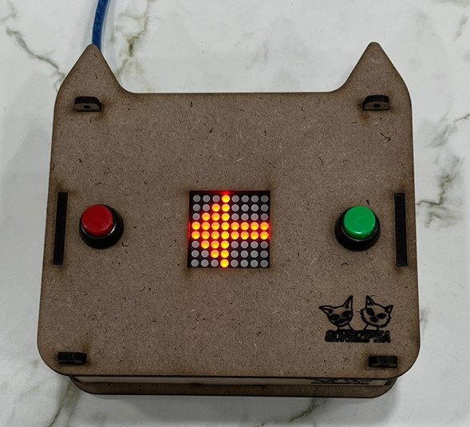

# Gongzipsa 반응속도게임 키트 제작
- 버튼을 누르면 시작되며 X가 O로 바뀐 순간 먼저 버튼을 눌렀다가 뗄 쪽을 화살표로 가르킴

## 사용 부품
- 8x8 dot matrix(1개)
- push button(2개)
- arudino nano

## 라이브러리
- LedControl by Eberhard Fahle : dot matrix를 사용하기위한 라이브러리

## 사용 방법
1. 회로 연결
1. 아두이노 pc 연결 후 라이브러리 설치([라이브러리설치방법](https://blog.naver.com/gongzipsa/222899480689))
1. main_code.ino 업로드
1. 아무버튼 누를 시 시작
1. X 표시 이후 O 표기되며 O가 표기된 순간 먼저 버튼을 눌렀다 뗀 쪽을 화살표로 가르킴

## 결선이미지

## 제품사진
